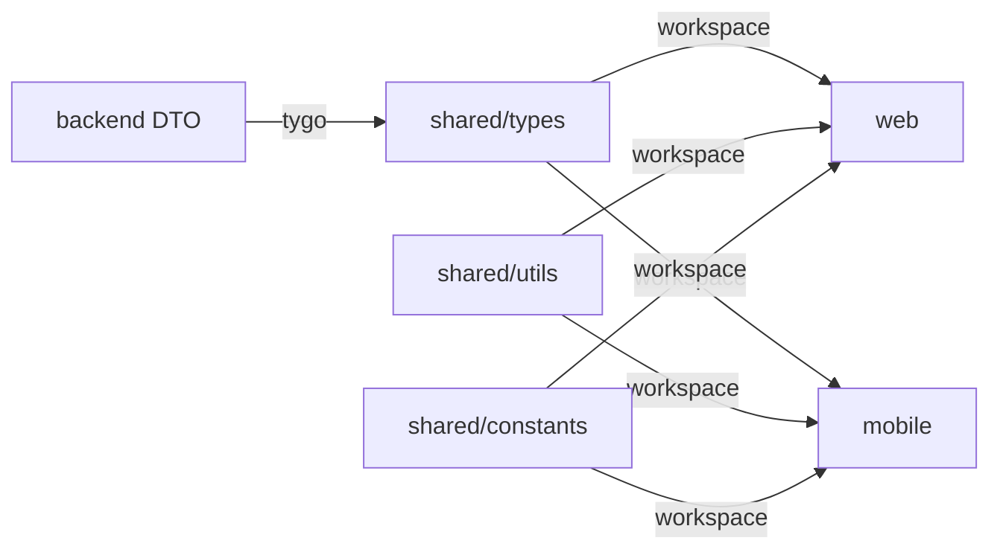

# ✅ Shared Packages 设置完成

已成功为 Go-GenAI-Stack 创建完整的 pnpm workspace Monorepo 架构！

## 📦 创建的文件清单

### 根目录配置

- ✅ `pnpm-workspace.yaml` - pnpm workspace 配置
- ✅ `package.json` - 根 package.json，定义全局脚本
- ✅ `.gitignore` - Git 忽略规则

### Shared 包

#### shared/types/
- ✅ `package.json` - 类型包配置
- ✅ `tsconfig.json` - TypeScript 配置
- ✅ `index.ts` - 统一导出
- ✅ `domains/chat.ts` - 聊天领域类型（placeholder）
- ✅ `domains/llm.ts` - LLM 领域类型（placeholder）
- ✅ `domains/monitoring.ts` - 监控领域类型（placeholder）
- ✅ `README.md` - 使用文档

#### shared/utils/
- ✅ `package.json` - 工具包配置
- ✅ `tsconfig.json` - TypeScript 配置
- ✅ `index.ts` - 统一导出
- ✅ `format.ts` - 格式化函数
- ✅ `validation.ts` - 验证函数
- ✅ `storage.ts` - 存储抽象
- ✅ `README.md` - 使用文档

#### shared/constants/
- ✅ `package.json` - 常量包配置
- ✅ `tsconfig.json` - TypeScript 配置
- ✅ `index.ts` - 统一导出
- ✅ `api-endpoints.ts` - API 端点常量
- ✅ `error-codes.ts` - 错误码常量
- ✅ `models.ts` - 模型常量
- ✅ `README.md` - 使用文档

#### shared/
- ✅ `README.md` - Shared 包总览

### Web 前端

- ✅ `web/package.json` - Web 依赖配置
- ✅ `web/tsconfig.json` - Web TypeScript 配置
- ✅ `web/src/features/chat/api/chatApi.ts` - API 调用示例
- ✅ `web/src/features/chat/components/MessageItem.tsx` - 组件示例

### Mobile 前端

- ✅ `mobile/package.json` - Mobile 依赖配置
- ✅ `mobile/tsconfig.json` - Mobile TypeScript 配置
- ✅ `mobile/src/features/chat/api/chatApi.ts` - API 调用示例

### 脚本

- ✅ `scripts/sync_types.sh` - 类型同步脚本（已更新）

### 配置

- ✅ `tygo.yaml` - tygo 配置（已更新为 shared/types）

### 文档

- ✅ `docs/monorepo-setup.md` - Monorepo 设置完整指南
- ✅ `docs/quick-reference.md` - 快速参考手册
- ✅ `docs/SETUP_COMPLETE.md` - 本文档

## 🎯 架构概览

```
go-genai-stack/
├── backend/                          Go 后端
│   └── domains/                      DDD 领域
│       └── chat/
│           └── http/dto/             ← tygo 来源
│
├── web/                              React Web
│   ├── src/features/                 功能模块
│   └── package.json                  依赖 shared/*
│
├── mobile/                           React Native
│   ├── src/features/
│   └── package.json                  依赖 shared/*
│
└── shared/                           共享包（独立）
    ├── types/                        → tygo 输出到这里
    │   └── domains/
    ├── utils/                        工具函数
    └── constants/                    常量定义
```

## 🔄 数据流



## 📝 下一步操作

### 1. 安装依赖

```bash
# 安装前端依赖
pnpm install

# 安装后端依赖
cd backend && go mod download && cd ..

# 安装 tygo
go install github.com/gzuidhof/tygo@latest
```

### 2. 创建后端 DTO（如果还没有）

```bash
mkdir -p backend/domains/chat/http/dto
mkdir -p backend/domains/llm/http/dto
mkdir -p backend/domains/monitoring/http/dto
```

示例 DTO:

```go
// backend/domains/chat/http/dto/send_message.go
package dto

type SendMessageRequest struct {
    UserID  string `json:"user_id" binding:"required"`
    Message string `json:"message" binding:"required"`
    Model   string `json:"model,omitempty"`
}

type SendMessageResponse struct {
    MessageID string `json:"message_id"`
    Content   string `json:"content"`
    Tokens    int    `json:"tokens"`
}
```

### 3. 生成类型

```bash
pnpm sync
```

### 4. 验证安装

```bash
# 检查 workspace 链接
pnpm list --depth 0

# 应该看到：
# @go-genai-stack/types -> link:shared/types
# @go-genai-stack/utils -> link:shared/utils
# @go-genai-stack/constants -> link:shared/constants
```

### 5. 启动开发

```bash
# 启动所有服务
pnpm dev

# 或分别启动
pnpm dev:backend
pnpm dev:web
pnpm dev:mobile
```

## ✨ 关键特性

### ✅ 类型安全

- 后端 Go Structs → 前端 TypeScript 类型
- 编译时检查，避免运行时错误
- 修改后端 DTO，前端立即感知

### ✅ 代码复用

- Web 和 Mobile 共享类型定义
- 共享工具函数（格式化、验证等）
- 共享常量（API 路径、错误码等）

### ✅ Vibe Coding Friendly

- 单一真理源：后端 DTO → `shared/types`
- 清晰的模块边界：API 类型 vs UI 类型
- AI 友好的目录结构和命名

### ✅ Monorepo 优势

- 统一依赖管理（pnpm workspace）
- 原子化提交（类型 + 前后端实现）
- 简化的开发流程

## 📚 使用示例

### Web 发送消息

```typescript
// web/src/features/chat/components/ChatInput.tsx
import { sendMessage } from '../api/chatApi';
import type { SendMessageRequest } from '@go-genai-stack/types';
import { MODELS } from '@go-genai-stack/constants';

async function handleSend(text: string) {
  const request: SendMessageRequest = {
    user_id: currentUser.id,
    message: text,
    model: MODELS.GPT4O,
  };
  
  const response = await sendMessage(request);
  // response 是类型安全的 SendMessageResponse
  console.log(response.message_id);
}
```

### Mobile 展示消息

```typescript
// mobile/src/features/chat/components/MessageItem.tsx
import type { SendMessageResponse } from '@go-genai-stack/types';
import { formatRelativeTime, formatTokenCount } from '@go-genai-stack/utils';

function MessageItem({ message }: { message: SendMessageResponse }) {
  return (
    <View>
      <Text>{message.content}</Text>
      <Text>{formatTokenCount(message.tokens)} tokens</Text>
    </View>
  );
}
```

## 🎉 完成！

你的 Monorepo 已经设置完毕，可以开始 Vibe Coding 了！

## 🔗 相关文档

- [Monorepo 设置指南](./monorepo-setup.md) - 详细设置说明
- [快速参考](./quick-reference.md) - 常用命令和模板
- [Shared 包文档](../shared/README.md) - 共享包详细说明
- [类型同步指南](./type-sync.md) - 类型同步深入指南
- [主 README](../README.md) - 项目概览

## 💡 提示

- 修改后端 DTO 后，记得运行 `pnpm sync`
- 使用 `@go-genai-stack/*` 导入共享包
- 遵循 [最佳实践](./monorepo-setup.md#-最佳实践)
- 遇到问题查看 [常见问题](./monorepo-setup.md#-常见问题)

