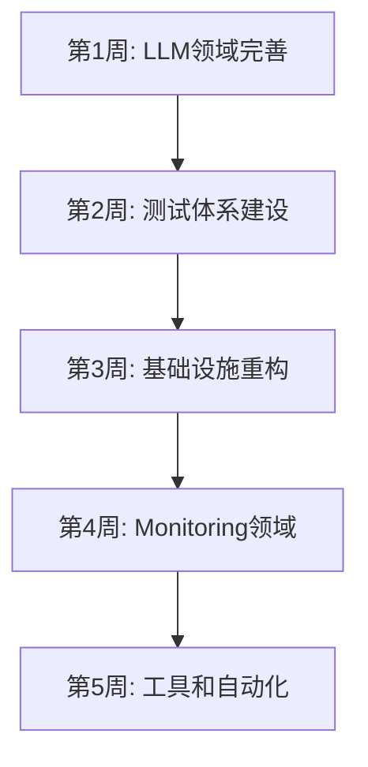

# Backend 架构优化计划 (Vibe-Coding-Friendly 极致版)

> **目标**：将 backend 架构调整为 Vibe-Coding-Friendly 的极致状态，实现 "一句话修改系统" 的 AI 协作开发体验。
>
> **预计工期**：5 周
>
> **最后更新**：2025-11-22

---

## 📊 当前状态评估

### ✅ 已完成
- Chat 领域的 6 个必需文件完整
- Chat 领域的代码组织清晰
- 基本的 HTTP 路由和 handlers
- 基础的错误处理和中间件

### ❌ 关键缺失
1. **LLM 领域的 usecases.yaml 和显式知识文件**（最严重）
2. **所有领域缺少 tests/ 目录**
3. **缺少 domains/shared/events/ 事件总线**
4. **缺少 Monitoring 领域**
5. **缺少 AI 代码生成脚本**

---

## 🎯 优化路线图



---

## 📅 第 1 周：完善 LLM 领域（P0 - 最高优先级）

### 目标
让 LLM 领域达到与 Chat 领域相同的成熟度。

### 任务清单

#### 1.1 创建显式知识文件

- [ ] **创建 `backend/domains/llm/glossary.md`**
  - 定义术语：Model, Provider, Token, Schema, Router, Adapter
  - 说明各个术语之间的关系
  - 每个术语 100-200 字说明

- [ ] **创建 `backend/domains/llm/rules.md`**
  - R1: 模型选择规则（延迟、成本、质量）
  - R2: Schema 验证规则
  - R3: 重试和超时规则
  - R4: Token 限制规则
  - R5: 路由策略规则
  - R6: Provider 降级规则
  - 每条规则包含：约束、错误码、示例代码

- [ ] **创建 `backend/domains/llm/events.md`**
  - ModelSelected (模型选择事件)
  - GenerationStarted (生成开始)
  - GenerationCompleted (生成完成)
  - GenerationFailed (生成失败)
  - SchemaValidationFailed (Schema 验证失败)
  - ProviderDegraded (Provider 降级)
  - 每个事件包含：payload、触发条件、consumers

- [ ] **创建 `backend/domains/llm/usecases.yaml`** ⭐ 最关键
  ```yaml
  usecases:
    SelectModel:
      description: "根据策略选择最优模型"
      steps: [...]
    
    Generate:
      description: "调用 LLM 生成文本"
      steps: [...]
    
    GenerateStructured:
      description: "生成结构化输出（Go Struct）"
      steps: [...]
    
    Stream:
      description: "流式生成文本"
      steps: [...]
  ```

- [ ] **创建 `backend/domains/llm/ai-metadata.json`**
  - domain: "llm"
  - version: "1.0.0"
  - vector_tags
  - use_cases
  - aggregates
  - dependencies

- [ ] **完善 `backend/domains/llm/README.md`**
  - 添加用例列表指向 usecases.yaml
  - 添加术语指向 glossary.md
  - 添加规则指向 rules.md
  - 添加事件指向 events.md

#### 1.2 创建领域模型

- [ ] **创建 `backend/domains/llm/model/` 目录**
  - `model.go` - 模型实体 (ModelID, Name, Provider, MaxTokens, PricingPerToken)
  - `provider.go` - 提供商实体 (ProviderID, Name, Status, HealthScore)
  - `model_stats.go` - 模型统计值对象 (AvgLatency, SuccessRate, TotalCalls)
  - `pricing.go` - 价格配置值对象 (InputPrice, OutputPrice, Currency)
  - `route_strategy.go` - 路由策略值对象 (StrategyType: latency/cost/quality)

#### 1.3 创建领域服务

- [ ] **创建 `backend/domains/llm/services/` 目录**
  - `model_router.go` - 多模型路由服务
    ```go
    type ModelRouter interface {
        SelectModel(ctx context.Context, strategy RouteStrategy) (*Model, error)
        GetAvailableModels(ctx context.Context) ([]*Model, error)
    }
    ```
  
  - `structured_output.go` - 结构化输出服务
    ```go
    type StructuredOutputService interface {
        Generate(ctx context.Context, req *StructuredRequest) (interface{}, error)
        ValidateSchema(schema interface{}) error
    }
    ```
  
  - `schema_generator.go` - Schema 生成器
    ```go
    func GenerateJSONSchema(structType interface{}) (string, error)
    ```
  
  - `schema_validator.go` - Schema 验证器
    ```go
    func ValidateAgainstSchema(data string, schema string) error
    ```

#### 1.4 创建仓储层

- [ ] **创建 `backend/domains/llm/repository.go`** (接口)
  ```go
  type ModelRepository interface {
      GetModelByID(ctx context.Context, id string) (*Model, error)
      ListModels(ctx context.Context, filter ModelFilter) ([]*Model, error)
      UpdateModelStats(ctx context.Context, id string, stats *ModelStats) error
  }
  
  type ProviderRepository interface {
      GetProviderByID(ctx context.Context, id string) (*Provider, error)
      UpdateProviderStatus(ctx context.Context, id string, status ProviderStatus) error
  }
  ```

- [ ] **创建 `backend/domains/llm/repository_impl.go`** (实现)
  - 基于内存或配置文件的实现（初期）
  - 预留数据库持久化接口（后期）

#### 1.5 完善 Handlers

- [ ] **完善 `backend/domains/llm/handlers/generate.handler.go`**
  - 添加与 usecases.yaml 的链接注释
  - 按照 usecases.yaml 的 steps 实现
  - 添加错误处理（基于 rules.md）

- [ ] **创建 `backend/domains/llm/handlers/select_model.handler.go`**
  - 实现模型选择逻辑
  - 根据策略（延迟/成本/质量）选择

- [ ] **创建 `backend/domains/llm/handlers/generate_structured.handler.go`**
  - 实现结构化输出
  - Schema 生成和验证

- [ ] **创建 `backend/domains/llm/handlers/stream.handler.go`**
  - 流式生成
  - SSE 推送

#### 1.6 创建外部适配器

- [ ] **创建 `backend/domains/llm/adapters/` 目录**
  - `eino_adapter.go` - Eino 框架适配器（主要）
  - `openai_adapter.go` - OpenAI 直连适配器（备用）
  - `claude_adapter.go` - Claude 直连适配器（备用）
  - `adapter_interface.go` - 统一适配器接口

#### 1.7 完善 HTTP 层

- [ ] **完善 `backend/domains/llm/http/dto/generate.go`**
  - 添加 StructuredRequest
  - 添加 StreamRequest
  - 添加完整的 validation tags

- [ ] **创建 `backend/domains/llm/http/dto/select_model.go`**
  ```go
  type SelectModelRequest struct {
      Strategy string `json:"strategy" binding:"oneof=latency cost quality"`
      Requirements *ModelRequirements `json:"requirements"`
  }
  ```

- [ ] **完善 `backend/domains/llm/http/router.go`**
  - POST /api/llm/generate
  - POST /api/llm/stream
  - POST /api/llm/structured
  - POST /api/llm/select-model
  - GET  /api/llm/models

### 验收标准
- [ ] LLM 领域有完整的 6 个必需文件
- [ ] usecases.yaml 包含至少 4 个核心用例
- [ ] 所有 handler 都有与 usecases.yaml 的链接注释
- [ ] 代码结构与 Chat 领域保持一致

---

## 📅 第 2 周：测试体系建设（P0 - 最高优先级）

### 目标
为所有领域建立完整的测试体系，确保业务规则可验证。

### 任务清单

#### 2.1 Chat 领域测试

- [ ] **创建 `backend/domains/chat/tests/` 目录**

- [ ] **创建 `backend/domains/chat/tests/send_message.test.go`**
  - 测试所有成功路径
  - 测试所有错误场景（基于 usecases.yaml 的 errors 列表）
  - 使用 Table-Driven Tests 模式

- [ ] **创建 `backend/domains/chat/tests/stream_message.test.go`**
  - 测试流式传输
  - 测试连接中断
  - 测试超时处理

- [ ] **创建 `backend/domains/chat/tests/conversation.test.go`**
  - 测试对话创建、查询、删除
  - 测试对话列表分页
  - 测试历史记录查询

- [ ] **创建 `backend/domains/chat/tests/rules.test.go`** ⭐ 关键
  - 为 rules.md 中的每条规则创建测试
  - R1: 消息内容验证
  - R2: 消息角色限制
  - R3: 消息顺序约束
  - R4: 对话所有权
  - R5-R16: 所有其他规则

- [ ] **创建 `backend/domains/chat/tests/usecases.test.go`**
  - 基于 usecases.yaml 自动生成测试骨架
  - 验证每个 step 的执行顺序
  - 验证 on_fail 策略

#### 2.2 LLM 领域测试

- [ ] **创建 `backend/domains/llm/tests/` 目录**

- [ ] **创建 `backend/domains/llm/tests/generate.test.go`**
  - Mock Eino 适配器
  - 测试成功生成
  - 测试超时重试
  - 测试 Provider 降级

- [ ] **创建 `backend/domains/llm/tests/model_router.test.go`**
  - 测试延迟优先策略
  - 测试成本优先策略
  - 测试质量优先策略
  - 测试模型不可用降级

- [ ] **创建 `backend/domains/llm/tests/structured_output.test.go`**
  - 测试 Schema 生成
  - 测试 Schema 验证
  - 测试结构化输出解析
  - 测试验证失败场景

- [ ] **创建 `backend/domains/llm/tests/rules.test.go`**
  - 为 rules.md 中的每条规则创建测试

#### 2.3 测试基础设施

- [ ] **创建 `backend/domains/shared/testing/` 目录**
  - `helpers.go` - 测试辅助函数
  - `mocks.go` - 通用 Mock 对象
  - `fixtures.go` - 测试数据 Fixtures

- [ ] **创建 `backend/scripts/run_tests.sh`**
  ```bash
  #!/bin/bash
  # 运行所有领域测试
  echo "Running Chat domain tests..."
  go test -v ./domains/chat/tests/...
  
  echo "Running LLM domain tests..."
  go test -v ./domains/llm/tests/...
  
  echo "Coverage report..."
  go test -coverprofile=coverage.out ./domains/...
  go tool cover -html=coverage.out -o coverage.html
  ```

### 验收标准
- [ ] 所有领域都有 tests/ 目录
- [ ] rules.md 中的每条规则都有对应的测试
- [ ] usecases.yaml 中的每个用例都有测试
- [ ] 测试覆盖率 > 80%

---

## 📅 第 3 周：基础设施重构（P1 - 高优先级）

### 目标
规范基础设施层，解耦领域间通信。

### 任务清单

#### 3.1 目录重命名和重构

- [ ] **将 `backend/infra/` 重命名为 `backend/infrastructure/`**

- [ ] **重构 infrastructure 目录结构**
  ```
  infrastructure/
  ├── persistence/
  │   ├── postgres/
  │   │   ├── connection.go
  │   │   ├── transaction.go
  │   │   └── query_builder.go
  │   └── redis/
  │       ├── connection.go
  │       └── cache.go
  ├── queue/
  │   ├── asynq_client.go
  │   └── tasks/
  │       └── task_registry.go
  ├── middleware/
  │   ├── auth.go
  │   ├── ratelimit.go
  │   ├── logging.go
  │   ├── recovery.go
  │   └── tracing.go
  └── config/
      ├── config.go
      ├── loader.go
      └── validator.go
  ```

- [ ] **将 `backend/shared/middleware/` 移动到 `backend/infrastructure/middleware/`**

- [ ] **更新所有 import 路径**

#### 3.2 完善持久化层

- [ ] **创建 `backend/infrastructure/persistence/postgres/connection.go`**
  - 连接池管理
  - 健康检查
  - 重连机制

- [ ] **创建 `backend/infrastructure/persistence/postgres/transaction.go`**
  - 事务管理辅助函数
  - 自动提交/回滚

- [ ] **创建 `backend/infrastructure/persistence/redis/connection.go`**
  - Redis 连接池
  - 集群支持

- [ ] **创建 `backend/infrastructure/persistence/redis/cache.go`**
  - 缓存接口实现
  - TTL 管理

#### 3.3 异步任务队列

- [ ] **创建 `backend/infrastructure/queue/` 目录**

- [ ] **创建 `backend/infrastructure/queue/asynq_client.go`**
  ```go
  type AsyncQueue interface {
      Enqueue(taskType string, payload []byte, opts ...asynq.Option) error
      RegisterHandler(taskType string, handler func(context.Context, []byte) error)
      Start() error
      Shutdown() error
  }
  ```

- [ ] **创建 `backend/infrastructure/queue/tasks/task_registry.go`**
  - 任务类型注册
  - 任务处理器映射

#### 3.4 配置管理

- [ ] **创建 `backend/infrastructure/config/config.go`**
  ```go
  type Config struct {
      Server    ServerConfig
      Database  DatabaseConfig
      Redis     RedisConfig
      LLM       LLMConfig
      Queue     QueueConfig
  }
  ```

- [ ] **创建 `backend/infrastructure/config/loader.go`**
  - 从环境变量加载
  - 从配置文件加载
  - 配置合并和覆盖

- [ ] **创建 `backend/infrastructure/config/validator.go`**
  - 配置验证
  - 必填项检查

#### 3.5 事件总线（关键）

- [ ] **创建 `backend/domains/shared/events/` 目录**

- [ ] **创建 `backend/domains/shared/events/bus.go`**
  ```go
  type EventBus interface {
      Publish(ctx context.Context, event Event) error
      Subscribe(eventType string, handler EventHandler) error
      Unsubscribe(eventType string, handler EventHandler) error
  }
  
  type Event interface {
      Type() string
      Payload() interface{}
      Timestamp() time.Time
      Source() string // 来源领域
  }
  
  type EventHandler func(ctx context.Context, event Event) error
  ```

- [ ] **创建 `backend/domains/shared/events/types.go`**
  ```go
  // Chat 领域事件
  type MessageSentEvent struct { ... }
  type MessageReceivedEvent struct { ... }
  type ConversationCreatedEvent struct { ... }
  
  // LLM 领域事件
  type ModelSelectedEvent struct { ... }
  type GenerationCompletedEvent struct { ... }
  ```

- [ ] **创建 `backend/domains/shared/events/publisher.go`**
  - 内存实现（开发环境）
  - Kafka 实现（生产环境，预留）

#### 3.6 共享类型

- [ ] **创建 `backend/domains/shared/types/common.go`**
  ```go
  type Pagination struct {
      Limit  int
      Offset int
  }
  
  type PaginatedResponse struct {
      Data       interface{}
      TotalCount int
      HasMore    bool
  }
  
  type UserContext struct {
      UserID string
      Role   string
  }
  ```

#### 3.7 中间件完善

- [ ] **创建 `backend/infrastructure/middleware/auth.go`**
  - 用户认证
  - Token 验证

- [ ] **创建 `backend/infrastructure/middleware/ratelimit.go`**
  - 基于 Redis 的限流
  - Token Bucket 算法

- [ ] **创建 `backend/infrastructure/middleware/tracing.go`**
  - 分布式追踪
  - OpenTelemetry 集成（预留）

### 验收标准
- [ ] infra/ 改名为 infrastructure/
- [ ] middleware 移动到 infrastructure/
- [ ] 事件总线可用（内存实现）
- [ ] 所有领域可以通过事件通信
- [ ] 配置管理完整

---

## 📅 第 4 周：创建 Monitoring 领域（P1 - 高优先级）

### 目标
建立完整的监控、追踪、成本统计领域。

### 任务清单

#### 4.1 创建领域结构

- [ ] **创建 `backend/domains/monitoring/` 目录**

#### 4.2 显式知识文件

- [ ] **创建 `backend/domains/monitoring/README.md`**
  - 领域概述：监控、追踪、成本统计
  - 职责范围：Metrics、Trace、Cost、Alert
  - 不包含的职责：日志聚合（属于 Infra）

- [ ] **创建 `backend/domains/monitoring/glossary.md`**
  - Trace - 追踪链路
  - Metric - 指标
  - Span - 追踪片段
  - P95/P99 - 百分位延迟
  - Cost - 成本（Token 费用）
  - Alert - 告警

- [ ] **创建 `backend/domains/monitoring/rules.md`**
  - R1: 采样率规则（生产环境 10%，开发环境 100%）
  - R2: 指标聚合规则（1分钟、5分钟、1小时）
  - R3: 告警阈值规则
  - R4: 成本计算规则
  - R5: 数据保留规则（Trace 保留 7 天，Metric 保留 30 天）

- [ ] **创建 `backend/domains/monitoring/events.md`**
  - MetricCollected
  - TraceStarted
  - TraceCompleted
  - AlertTriggered
  - CostThresholdExceeded

- [ ] **创建 `backend/domains/monitoring/usecases.yaml`**
  ```yaml
  usecases:
    CollectMetrics:
      description: "收集性能指标"
      steps: [...]
    
    RecordTrace:
      description: "记录追踪链路"
      steps: [...]
    
    QueryStats:
      description: "查询统计数据"
      steps: [...]
    
    TriggerAlert:
      description: "触发告警"
      steps: [...]
    
    CalculateCost:
      description: "计算 Token 成本"
      steps: [...]
  ```

- [ ] **创建 `backend/domains/monitoring/ai-metadata.json`**

#### 4.3 领域模型

- [ ] **创建 `backend/domains/monitoring/model/` 目录**
  - `trace.go` - 追踪实体
    ```go
    type Trace struct {
        TraceID    string
        SpanID     string
        ParentID   string
        Operation  string
        StartTime  time.Time
        Duration   time.Duration
        Status     TraceStatus
        Tags       map[string]string
    }
    ```
  
  - `metric.go` - 指标实体
    ```go
    type Metric struct {
        Name       string
        Type       MetricType // Counter, Gauge, Histogram
        Value      float64
        Timestamp  time.Time
        Labels     map[string]string
    }
    ```
  
  - `latency_stats.go` - 延迟统计值对象
    ```go
    type LatencyStats struct {
        P50  time.Duration
        P95  time.Duration
        P99  time.Duration
        Avg  time.Duration
        Max  time.Duration
    }
    ```
  
  - `cost_stats.go` - 成本统计值对象
    ```go
    type CostStats struct {
        TotalTokens      int64
        InputTokens      int64
        OutputTokens     int64
        TotalCost        float64
        Currency         string
        CalculatedAt     time.Time
    }
    ```

#### 4.4 领域服务

- [ ] **创建 `backend/domains/monitoring/services/` 目录**
  - `metrics_collector.go` - 指标收集服务
  - `trace_service.go` - 链路追踪服务
  - `stats_aggregator.go` - 统计聚合服务（异步）
  - `cost_calculator.go` - 成本计算服务
  - `alert_manager.go` - 告警管理服务

#### 4.5 仓储层

- [ ] **创建 `backend/domains/monitoring/repository.go`**
  ```go
  type MetricsRepository interface {
      SaveMetric(ctx context.Context, metric *Metric) error
      QueryMetrics(ctx context.Context, query MetricQuery) ([]*Metric, error)
      AggregateMetrics(ctx context.Context, query AggregationQuery) (*AggregatedStats, error)
  }
  
  type TraceRepository interface {
      SaveTrace(ctx context.Context, trace *Trace) error
      GetTrace(ctx context.Context, traceID string) (*Trace, error)
      QueryTraces(ctx context.Context, query TraceQuery) ([]*Trace, error)
  }
  ```

- [ ] **创建 `backend/domains/monitoring/repository_impl.go`**
  - 基于 TimescaleDB（时序数据库，推荐）
  - 或 PostgreSQL + 分区表
  - Redis 缓存热数据

#### 4.6 Handlers

- [ ] **创建 `backend/domains/monitoring/handlers/` 目录**
  - `collect_metrics.handler.go`
  - `record_trace.handler.go`
  - `query_stats.handler.go`
  - `trigger_alert.handler.go`

#### 4.7 HTTP 层

- [ ] **创建 `backend/domains/monitoring/http/dto/` 目录**
  - `metrics.go`
  - `trace.go`
  - `stats_query.go`

- [ ] **创建 `backend/domains/monitoring/http/router.go`**
  - POST /api/monitoring/metrics
  - POST /api/monitoring/traces
  - GET  /api/monitoring/stats
  - GET  /api/monitoring/costs

#### 4.8 测试

- [ ] **创建 `backend/domains/monitoring/tests/` 目录**
  - `metrics_collector.test.go`
  - `trace_service.test.go`
  - `cost_calculator.test.go`
  - `rules.test.go`

#### 4.9 与其他领域集成

- [ ] **在 Chat 领域的 handlers 中添加监控埋点**
  ```go
  // 在 send_message.handler.go 中
  func SendMessage(ctx context.Context, req *SendMessageRequest) (*SendMessageResponse, error) {
      // 开始追踪
      trace := monitoring.StartTrace(ctx, "chat.SendMessage")
      defer trace.End()
      
      // 记录指标
      monitoring.RecordMetric(ctx, "chat.messages.sent", 1, map[string]string{
          "user_id": req.UserID,
          "model": req.Model,
      })
      
      // ... 业务逻辑 ...
      
      // 记录成本
      monitoring.RecordCost(ctx, &CostRecord{
          Tokens: response.Tokens,
          Model: response.Model,
      })
  }
  ```

- [ ] **在 LLM 领域的 handlers 中添加监控埋点**

### 验收标准
- [ ] Monitoring 领域有完整的 6 个必需文件
- [ ] 可以收集和查询 Metrics
- [ ] 可以记录和查询 Trace
- [ ] 可以计算 Token 成本
- [ ] 其他领域已集成监控埋点

---

## 📅 第 5 周：工具和自动化（P2 - 中优先级）

### 目标
实现 AI 辅助代码生成和开发工具链。

### 任务清单

#### 5.1 可复用工具包

- [ ] **创建 `backend/pkg/` 目录**

- [ ] **创建 `backend/pkg/logger/` 目录**
  - `logger.go` - 日志接口
  - `zap_logger.go` - Zap 实现
  - `logrus_logger.go` - Logrus 实现（可选）

- [ ] **创建 `backend/pkg/ratelimiter/` 目录**
  - `limiter.go` - 限流器接口
  - `redis_limiter.go` - Redis 实现（Token Bucket）
  - `memory_limiter.go` - 内存实现（开发环境）

- [ ] **创建 `backend/pkg/circuitbreaker/` 目录**
  - `breaker.go` - 熔断器接口
  - `gobreaker_impl.go` - gobreaker 实现

- [ ] **创建 `backend/pkg/validator/` 目录**
  - `validator.go` - 统一验证器
  - `custom_validators.go` - 自定义验证规则

#### 5.2 数据库迁移

- [ ] **创建 `backend/migrations/` 目录**

- [ ] **创建 `backend/migrations/postgres/` 目录**
  - `001_create_conversations_table.sql`
  ```sql
  CREATE TABLE conversations (
      id UUID PRIMARY KEY,
      user_id VARCHAR(255) NOT NULL,
      title VARCHAR(255),
      created_at TIMESTAMP NOT NULL,
      updated_at TIMESTAMP NOT NULL,
      INDEX idx_user_id (user_id)
  );
  ```
  
  - `002_create_messages_table.sql`
  ```sql
  CREATE TABLE messages (
      id UUID PRIMARY KEY,
      conversation_id UUID NOT NULL,
      role VARCHAR(50) NOT NULL,
      content TEXT NOT NULL,
      tokens INT NOT NULL,
      model VARCHAR(100),
      created_at TIMESTAMP NOT NULL,
      FOREIGN KEY (conversation_id) REFERENCES conversations(id) ON DELETE CASCADE,
      INDEX idx_conversation_id (conversation_id)
  );
  ```
  
  - `003_create_models_table.sql`
  - `004_create_metrics_table.sql`
  - `005_create_traces_table.sql`

- [ ] **添加迁移工具**
  - 使用 golang-migrate 或 goose
  - 创建 `scripts/migrate.sh`

#### 5.3 AI 代码生成脚本（⭐ 关键）

- [ ] **创建 `backend/scripts/ai_codegen.sh`**
  ```bash
  #!/bin/bash
  # AI 代码生成工具
  # 使用方式：./scripts/ai_codegen.sh --domain chat --usecase ExportConversation
  
  DOMAIN=$1
  USECASE=$2
  
  # 1. 读取显式知识文件
  echo "Reading domain knowledge..."
  README=$(cat domains/$DOMAIN/README.md)
  GLOSSARY=$(cat domains/$DOMAIN/glossary.md)
  RULES=$(cat domains/$DOMAIN/rules.md)
  EVENTS=$(cat domains/$DOMAIN/events.md)
  USECASES=$(cat domains/$DOMAIN/usecases.yaml)
  
  # 2. 提取用例定义
  echo "Extracting usecase: $USECASE"
  # 从 usecases.yaml 中提取指定用例
  
  # 3. 生成 Prompt
  PROMPT="Context: $README\n$GLOSSARY\n$RULES\n$USECASES\n\nTask: Generate handler and tests for $USECASE"
  
  # 4. 调用 AI API（Cursor AI / Claude / GPT）
  # 这里可以集成 Cursor API 或其他 LLM API
  
  # 5. 生成文件
  # - domains/$DOMAIN/handlers/${USECASE}.handler.go
  # - domains/$DOMAIN/tests/${USECASE}.test.go
  
  # 6. 更新 README.md
  echo "Updating README.md..."
  
  echo "Done! Files generated:"
  echo "  - domains/$DOMAIN/handlers/${USECASE}.handler.go"
  echo "  - domains/$DOMAIN/tests/${USECASE}.test.go"
  ```

- [ ] **创建 AI Prompt 模板**
  - `backend/scripts/templates/handler.prompt.txt`
  - `backend/scripts/templates/test.prompt.txt`

#### 5.4 文档生成

- [ ] **创建 `backend/scripts/generate_docs.sh`**
  ```bash
  #!/bin/bash
  # 自动生成领域文档
  
  # 1. 扫描所有领域
  for domain in domains/*; do
      if [ -d "$domain" ]; then
          echo "Generating docs for $domain..."
          
          # 2. 生成领域概览
          # 3. 生成用例列表
          # 4. 生成 API 文档
      fi
  done
  
  # 5. 生成整体架构图
  # 6. 生成依赖关系图
  ```

- [ ] **创建 `backend/scripts/validate_structure.sh`**
  ```bash
  #!/bin/bash
  # 验证领域结构完整性
  
  for domain in domains/*; do
      # 检查 6 个必需文件是否存在
      if [ ! -f "$domain/README.md" ]; then
          echo "ERROR: $domain/README.md missing"
      fi
      if [ ! -f "$domain/glossary.md" ]; then
          echo "ERROR: $domain/glossary.md missing"
      fi
      # ... 检查其他必需文件
  done
  ```

#### 5.5 开发工具完善

- [ ] **完善 `backend/scripts/dev.sh`**
  - 自动启动所有依赖（Postgres, Redis）
  - 运行数据库迁移
  - 启动热重载

- [ ] **创建 `backend/scripts/test_all.sh`**
  - 运行所有单元测试
  - 运行所有集成测试
  - 生成覆盖率报告

- [ ] **创建 `backend/scripts/lint.sh`**
  - golangci-lint
  - 代码风格检查
  - 命名规范检查

#### 5.6 CI/CD 集成

- [ ] **创建 `.github/workflows/test.yml`** (如果使用 GitHub)
  ```yaml
  name: Test
  on: [push, pull_request]
  jobs:
    test:
      runs-on: ubuntu-latest
      steps:
        - uses: actions/checkout@v2
        - name: Run tests
          run: ./scripts/test_all.sh
        - name: Validate structure
          run: ./scripts/validate_structure.sh
  ```

- [ ] **创建 `.github/workflows/ai_review.yml`**
  - PR 时自动触发 AI 代码审查
  - 检查是否符合 vibe-coding-friendly 规范

### 验收标准
- [ ] pkg/ 工具包可用
- [ ] 数据库迁移脚本可用
- [ ] ai_codegen.sh 可以生成基础代码骨架
- [ ] 所有开发脚本可正常运行
- [ ] CI/CD 流程配置完成

---

## 📋 补充任务（按需实施）

### P3 - 低优先级但有价值

#### CLI 工具

- [ ] **创建 `backend/domains/chat/cli/export_conversations.go`**
  - 导出用户对话到 JSON/CSV
  - 用于数据分析和备份

- [ ] **创建 `backend/domains/monitoring/cli/query_stats.go`**
  - 命令行查询统计数据
  - 快速定位性能问题

#### 内部工具

- [ ] **创建管理后台 API**
  - 用户管理
  - 模型配置管理
  - 监控数据可视化

#### 文档完善

- [ ] **创建 `docs/architecture-decisions.md`**
  - 记录重要的架构决策（ADR）
  - 为什么选择 Vibe-Coding-Friendly DDD

- [ ] **创建 `docs/onboarding.md`**
  - 新成员快速上手指南
  - 如何使用 AI 辅助开发

---

## ✅ 验收标准总览

### 架构完整性
- [ ] 所有领域都有完整的 6 个必需文件
- [ ] 所有领域都有 tests/ 目录且测试覆盖率 > 80%
- [ ] 所有领域都有 services/ 目录（复杂业务逻辑）
- [ ] infrastructure/ 目录结构规范

### AI 友好性
- [ ] 每个领域的 usecases.yaml 完整且可读
- [ ] 每个 handler 都有与 usecases.yaml 的链接
- [ ] ai_codegen.sh 可以生成代码骨架
- [ ] 所有 rules.md 都有对应的测试

### 可观测性
- [ ] Monitoring 领域完整可用
- [ ] 所有关键路径都有监控埋点
- [ ] 可以查询性能指标和成本

### 开发体验
- [ ] 开发脚本齐全（dev.sh, test_all.sh, migrate.sh）
- [ ] 文档完善且易读
- [ ] CI/CD 流程自动化

---

## 📊 进度跟踪

### 第 1 周进度
- [ ] Day 1-2: LLM 显式知识文件
- [ ] Day 3: LLM 领域模型和服务
- [ ] Day 4: LLM Handlers 和 HTTP
- [ ] Day 5: 代码审查和测试

### 第 2 周进度
- [ ] Day 1-2: Chat 领域测试
- [ ] Day 3-4: LLM 领域测试
- [ ] Day 5: 测试基础设施和脚本

### 第 3 周进度
- [ ] Day 1: 目录重构
- [ ] Day 2: 持久化层完善
- [ ] Day 3: 事件总线实现
- [ ] Day 4-5: 中间件和配置管理

### 第 4 周进度
- [ ] Day 1-2: Monitoring 领域结构和文件
- [ ] Day 3-4: Monitoring 实现
- [ ] Day 5: 集成到其他领域

### 第 5 周进度
- [ ] Day 1-2: pkg/ 工具包
- [ ] Day 3: 数据库迁移
- [ ] Day 4: AI 代码生成脚本
- [ ] Day 5: 文档和 CI/CD

---

## 🎯 关键成功指标（KPI）

1. **结构完整性**
   - 所有领域都有 6 个必需文件：100%
   - 测试覆盖率：> 80%

2. **AI 友好性**
   - usecases.yaml 覆盖率：> 90% 的核心用例
   - AI 生成代码可用率：> 70%

3. **开发效率**
   - 新增用例从设计到实现：< 2 小时
   - 修改用例从提出到上线：< 1 天

4. **可观测性**
   - 监控埋点覆盖率：100% 关键路径
   - 性能指标可查询：实时

---

## 📚 参考资料

- [Vibe-Coding-Friendly.md](./Vibe-Coding-Friendly.md) - 核心理念
- [vibe-coding-ddd-structure.md](./vibe-coding-ddd-structure.md) - 目录结构
- [optimal-architecture.md](./optimal-architecture.md) - 最优架构

---

## 🔄 持续改进

优化计划是动态的，每周 Review：

1. **每周五回顾**
   - 本周完成了什么
   - 遇到了什么问题
   - 下周计划调整

2. **每月评估**
   - KPI 达成情况
   - 架构健康度检查
   - AI 协作效果评估

3. **季度复盘**
   - 架构演进方向
   - 新技术引入评估
   - 团队效能提升

---

**最后更新**：2025-11-22  
**负责人**：Backend Team  
**预计完成时间**：2025-12-27  
**当前状态**：📝 计划制定完成，等待执行

