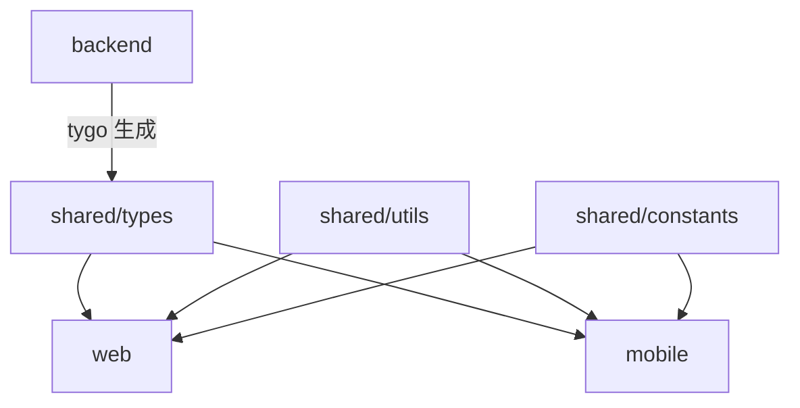

# Shared Packages

跨 Web 和 Mobile 平台共享的代码包。

## 📦 包列表

### [@go-genai-stack/types](./types)

TypeScript 类型定义，从后端 Go DTOs 自动生成。

**用途**：HTTP API 接口类型  
**生成方式**：`tygo` 自动生成  
**来源**：`backend/domains/*/http/dto`

```typescript
import { SendMessageRequest, SendMessageResponse } from '@go-genai-stack/types';
```

### [@go-genai-stack/utils](./utils)

工具函数库。

**用途**：格式化、验证、存储等通用工具  
**包含**：
- `format` - 时间、数字、金额格式化
- `validation` - 邮箱、URL、消息验证
- `storage` - 统一存储接口（Web localStorage / RN AsyncStorage）

```typescript
import { formatRelativeTime, isValidEmail, createStorage } from '@go-genai-stack/utils';
```

### [@go-genai-stack/constants](./constants)

常量定义。

**用途**：API 端点、错误码、模型常量  
**包含**：
- `api-endpoints` - API 路径常量
- `error-codes` - 错误码和错误消息
- `models` - LLM 模型元数据

```typescript
import { API_ENDPOINTS, ERROR_CODES, MODELS } from '@go-genai-stack/constants';
```

## 🏗️ Monorepo 架构

本项目使用 **pnpm workspace** 管理 Monorepo：

```
go-genai-stack/
├── backend/          # Go 后端
├── web/             # React Web 前端
├── mobile/          # React Native 移动端
└── shared/          # 共享包（TypeScript）
    ├── types/       # 接口类型
    ├── utils/       # 工具函数
    └── constants/   # 常量定义
```

## 📋 依赖关系



## 🚀 使用方式

### 在 Web 中使用

**package.json**:
```json
{
  "dependencies": {
    "@go-genai-stack/types": "workspace:*",
    "@go-genai-stack/utils": "workspace:*",
    "@go-genai-stack/constants": "workspace:*"
  }
}
```

**tsconfig.json**:
```json
{
  "compilerOptions": {
    "paths": {
      "@go-genai-stack/types": ["../shared/types"],
      "@go-genai-stack/utils": ["../shared/utils"],
      "@go-genai-stack/constants": ["../shared/constants"]
    }
  }
}
```

**使用示例**:
```typescript
// types
import { SendMessageRequest } from '@go-genai-stack/types';

// utils
import { formatRelativeTime } from '@go-genai-stack/utils';

// constants
import { API_ENDPOINTS } from '@go-genai-stack/constants';

async function sendMessage(message: string) {
  const request: SendMessageRequest = {
    user_id: currentUser.id,
    message,
  };
  
  const response = await fetch(API_ENDPOINTS.chat.send, {
    method: 'POST',
    body: JSON.stringify(request),
  });
  
  const data = await response.json();
  console.log('Sent at:', formatRelativeTime(new Date()));
  return data;
}
```

### 在 Mobile 中使用

配置方式与 Web 相同，只是导入路径稍有不同：

```typescript
import { SendMessageRequest } from '@go-genai-stack/types';
import { formatRelativeTime, createStorage, MobileStorageAdapter } from '@go-genai-stack/utils';
import AsyncStorage from '@react-native-async-storage/async-storage';

// 创建 Mobile 存储
const storage = createStorage(new MobileStorageAdapter(AsyncStorage));
```

## 🔄 工作流

### 1. 后端修改 DTO

```go
// backend/domains/chat/http/dto/send_message.go
type SendMessageRequest struct {
    UserID  string `json:"user_id"`
    Message string `json:"message"`
    Model   string `json:"model,omitempty"` // 新增字段
}
```

### 2. 运行类型同步

```bash
pnpm sync
# 或
./scripts/sync_types.sh
```

### 3. 前端自动获得类型

```typescript
// shared/types/domains/chat.ts（自动生成）
export interface SendMessageRequest {
  user_id: string;
  message: string;
  model?: string;  // ✅ 自动同步
}
```

### 4. Web/Mobile 直接使用

```typescript
// ✅ TypeScript 会自动检查类型
const request: SendMessageRequest = {
  user_id: userId,
  message: text,
  model: MODELS.GPT4O,  // ✅ 新字段可用
};
```

## 🧪 测试

```bash
# 测试所有共享包
pnpm -r --filter "./shared/*" test

# 测试特定包
pnpm --filter @go-genai-stack/utils test
```

## 🛠️ 添加新包

1. 在 `shared/` 下创建新目录
2. 添加 `package.json`：

```json
{
  "name": "@go-genai-stack/新包名",
  "version": "1.0.0",
  "private": true,
  "main": "index.ts",
  "types": "index.ts"
}
```

3. 添加 `tsconfig.json`（参考其他包）
4. 在 Web/Mobile 的 `package.json` 中添加依赖：

```json
{
  "dependencies": {
    "@go-genai-stack/新包名": "workspace:*"
  }
}
```

5. 运行 `pnpm install` 链接包

## 📝 最佳实践

### ✅ 应该放在 shared/ 的内容

- HTTP API 接口类型（tygo 生成）
- Web 和 Mobile 都需要的工具函数
- 通用的常量定义（错误码、API 路径等）
- 跨端的业务逻辑（罕见，但可能存在）

### ❌ 不应该放在 shared/ 的内容

- UI 组件（Web 和 Mobile 的组件库不同）
- 特定平台的 API（如 DOM API、RN Native Modules）
- UI 状态类型（应该在各自的 `features/` 中定义）
- 路由配置（Web 和 Mobile 路由机制不同）

### 🎯 类型的分类

| 类型 | 位置 | 示例 |
|------|------|------|
| HTTP API 接口 | `shared/types/` | `SendMessageRequest` |
| Web UI 状态 | `web/src/features/*/types.ts` | `ChatMessageUI` |
| Mobile UI 状态 | `mobile/src/features/*/types.ts` | `ChatMessageRN` |
| 共享业务类型 | `shared/types/` | `UserRole`, `Permission` |

## 🔗 相关文档

- [Vibe Coding 最优架构](../docs/optimal-architecture.md)
- [类型同步指南](../docs/type-sync.md)
- [DDD 架构](../docs/vibe-coding-ddd-structure.md)

